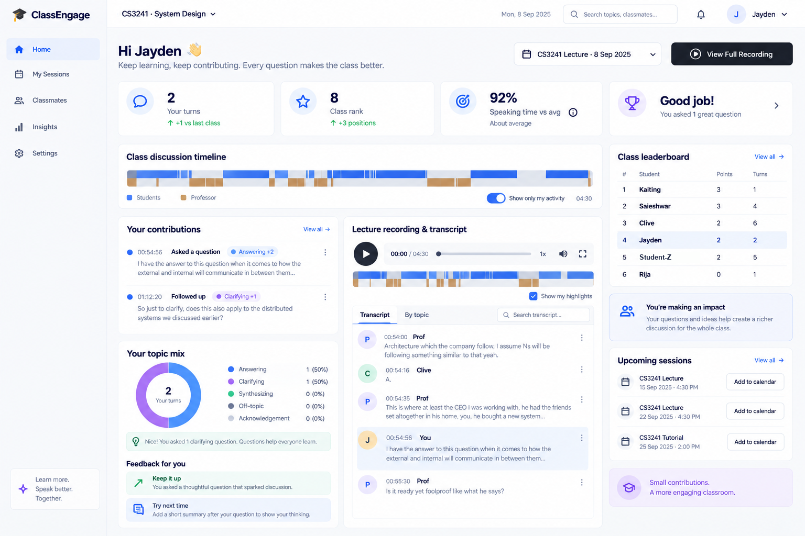

# Classroom Enhancement

Turn a single far-field recording of a university lecture into a per-student
participation record: who spoke, for how long, and whether what they said was
substantive.

This is a research prototype, not a product. It is **experimental only** — no
output here has ever affected a student's real grade. The interesting part is not
the pipeline; it is the measurement log in
[`experiments/exp1-enrollment-augmentation/README.md`](experiments/exp1-enrollment-augmentation/README.md),
which documents a threshold that was confidently wrong and the ground truth that
caught it.

## What it looks like

**Professor view.** Who spoke, how much, and what kind of contribution it was,
against the lecture audio itself.


Three things in this view carry the design:

- **"Unknown (matching gap)" is a headline number, labelled as an honesty metric.**
  The share of turns the system could not attribute is shown as prominently as the
  ones it could. When that number rises, the leaderboard below it is less
  trustworthy, and the professor should see both at once.
- **The timeline is the evidence.** Blue is student speech, orange is professor.
  Every row in the transcript and the leaderboard points back to a span on that
  bar, and clicking one plays the audio, so an attribution can be checked by ear
  in seconds.
- **"Learn from verified speakers" is a button, not a background job.** Confirmed
  clusters are room-mic recordings of a known voice, which is exactly the data the
  phone-clip enrollments lack. Folding them in is a deliberate, human-triggered
  action with a dry run, never automatic. See `scripts/apply_learning.py`.

**Student view.** The same lecture from one student's side.



A student sees their own turns, where they fall in the timeline, what kind of
contribution each was, and one concrete suggestion. The leaderboard is visible but
not the point; the framing is "you asked a clarifying question, here is what to
try next time," not a score to chase. The anti-gaming rules in `config.json` (a cap
on scored turns per window, a discount on repeated same-quality turns) exist
because a leaderboard invites the wrong behaviour the moment it becomes the
headline.

---

## The problem

Speaker attribution in a real classroom is an **open-set, cross-channel,
short-utterance** problem, and each of those three words costs accuracy:

| | Why it hurts |
|---|---|
| **Cross-channel** | Voiceprints are enrolled from students' phone clips (close-mic). The lecture is one room mic (far-field). Every cross-channel similarity score is compressed downward. |
| **Open-set** | Not every speaker in the room is enrolled. Some students never submitted a clip. For those, no threshold or model can produce the right answer — the only correct output is a refusal. |
| **Short utterances** | Half of classroom speech is `"Yeah."` / `"Okay."`. Measured in this project's own data: the same speaker loses **0.10 cosine similarity** going from a 34.1s segment to a 7.2s one. |

Published baselines for the cross-channel half alone (FFSVC 2020/2022) sit at
6.27–7.18% EER, versus ~0.92% for the same model class on matched clean audio.
Classroom diarization work from the Demszky group (Stanford, EDM 2024/2025)
reports ~17% DER teacher-vs-student and ~34–45% student-vs-student. Expect this
to be hard; it is.

---

## Pipeline

```
audio → diarize → transcribe → match → classify → score → dashboard
```

| Stage | Module | What it does |
|---|---|---|
| 1 | `pipeline/enroll.py` | ECAPA-TDNN (SpeechBrain) voiceprint per student from a submitted clip |
| 2 | `pipeline/diarize.py` | pyannote.audio 3.1 speaker-change detection — real clusters, not silence-bounded VAD chunks |
| 2 | `pipeline/transcribe.py` | FunASR / SenseVoiceSmall ASR |
| 3 | `pipeline/match.py` | Aggregate each diarized cluster, embed once, rank against the voiceprint DB |
| 4 | `pipeline/classify.py` | `gpt-4o-mini` labels each student turn: synthesizing / answering / clarifying / off-topic / acknowledgement |
| 5 | `pipeline/score.py` | Quality weights + anti-gaming rules → per-student and per-team totals |
| — | `dashboard/` | Next.js UI: professor timeline, student leaderboard, correction picker |

Each stage reads and writes exactly one JSON file in `data/`. That contract is
the point: the plumbing can become a queue or a DB later without touching a
single stage's logic.

### Design decisions worth reading the code for

- **`pipeline/candidates.py` — z-scores, not raw cosine.** Raw similarity is not
  comparable across clusters. Each cluster is normalised against its own
  candidate cohort (AS-Norm style), which removes the cross-channel offset. On
  the 8 verified decisions: enrolled-and-correct `z 2.20–8.56`, the one
  unenrolled speaker `z 1.97`.
- **`scripts/build_confusables.py` — leakage-aware runner-ups.** Two students
  whose reference vectors sit close (a confirmed pair scores 0.421 against each
  other) drag each other up. A confident top-1 whose runner-up is a known
  confusable partner is *not* a clean win, and gets routed to human review.
- **`scripts/apply_learning.py` — human-confirmed audio only.** When a professor
  confirms a cluster, that is 30+ seconds of that student's voice *through the
  room mic* — exactly what the phone-clip enrollment lacks. Ingesting the
  system's own high-confidence predictions instead would be a one-line change and
  is the single worst thing that could be done here: a wrong voiceprint wins more
  clusters, which enrich it further, and the rot is invisible because the
  similarity scores keep climbing. Every learned clip traces to a human verdict
  in `ground_truth.jsonl`.
- **`pipeline/diarize.py` — chunked diarization.** Single-pass holds a
  segmentation score, speaker embeddings, and an all-pairs similarity matrix for
  the whole file in memory at once. Chunking is what makes an 89-minute lecture
  survive on an 8 GB machine.

---

## What is not in this repository

| Excluded | Why |
|---|---|
| `audio/` | Student voice recordings are biometric data (PDPA). Enrollment files carry real names and student IDs. |
| `data/` | Voiceprint embeddings, transcripts, ground-truth labels, per-student scores — all identifiable. |
| `models/` | ~900 MB of auto-downloaded weights (SenseVoiceSmall, ECAPA). |
| `config.json` | The live roster. Use `config.example.json`. |

The one student whose full name appeared in code comments and the experiment log
is referred to as `Student-Z`. Everyone else appears by first name only inside
the research narrative.

---

## Setup

```bash
python3 -m venv .venv && source .venv/bin/activate
pip install -r requirements.txt

cp config.example.json config.json     # add your roster, teams, weights
cp .env.example .env                   # OPENAI_API_KEY (stage 4), HF_TOKEN (diarization)
```

`HF_TOKEN` needs a one-time manual step: accept the terms for
[pyannote/speaker-diarization-3.1](https://huggingface.co/pyannote/speaker-diarization-3.1)
and [pyannote/segmentation-3.0](https://huggingface.co/pyannote/segmentation-3.0),
then create a read token.

Place one clip per student at `audio/enrollment/<name>_1.wav` (16 kHz mono
`pcm_s16le`; 15–40s works), and the lecture at `audio/lectures/lecture_01.wav`.

## Run

```bash
./run_pipeline.sh                              # all five stages
./run_pipeline.sh path/to/my_lecture.wav

# or one stage at a time
python3 pipeline/enroll.py
python3 pipeline/transcribe.py audio/lectures/lecture_01.wav
python3 pipeline/match.py     audio/lectures/lecture_01.wav
python3 pipeline/classify.py
python3 pipeline/score.py
```

Ad-hoc tools:

```bash
python3 scripts/whospoke.py 1:05:30 1:08:00     # who spoke in one window; writes nothing
python3 scripts/build_confusables.py            # find dangerously similar voiceprint pairs
python3 scripts/apply_learning.py --dry-run     # enrich voiceprints from confirmed clusters
```

## Dashboard

```bash
cd dashboard && npm install && npm run dev
```

`/professor` (timeline + corrections), `/students` (leaderboard), `/experiments`
(the verified windows). It renders sample data until `data/scores.json` exists.

---

## Ethics

Students are told the system exists and that it does not affect their grade. It
does not. The real grade is tracked manually by the professor; this pipeline has
never been in that loop.

Two rules the code enforces rather than documents:

1. **Best-guess names are never exported or scored below the accept floor.** A
   low score may mean the true speaker is not in the database at all — that has
   been confirmed once already.
2. **Only human-verified audio enriches a voiceprint.** Never the system's own
   predictions. See `scripts/apply_learning.py`.
